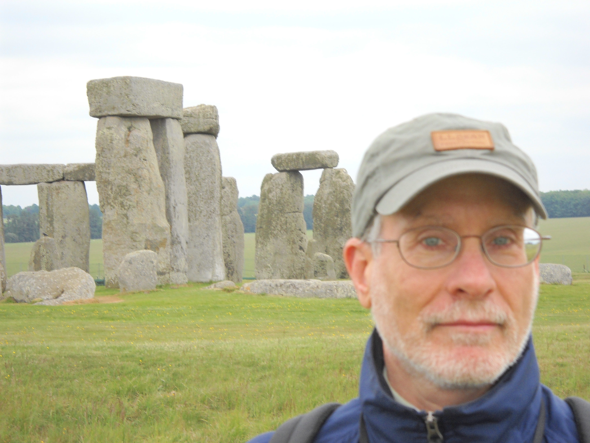

# Arthur Sherman

## Contact Address:

<addr>  
Arthur Sherman 
NIH-NIDDK-LBM 
Building 12A, Room 4007 
12A SOUTH DR MSC 5621 
Bethesda, MD 20892-5621 
phone: (301) 496 - 4325 
fax: (301) 402 - 0535 

[arthurs@niddk.nih.gov](mailto:arthurs@niddk.nih.gov)

* * *

## Research Interests and Approach

We use mathematical models to study the mechanisms of oscillatory electrical activity arising from ion channels in cell membranes and modulated by intracellular chemical processes. We are interested in both the behavior of single cells and the ways in which cells communicate and modify each other's behavior.

Our main application has been to the biophysical basis of insulin secretion in pancreatic beta-cells. We have examined bursting oscillations in membrane potential and the role of electrical coupling between cells in the islet of Langerhans. Long-term goals are to understand how the membrane dynamics interact with intracellular events to regulate secretion and to generalize to other secretory cells and neurons.

A second major focus has been mechanisms of synaptic transmission and short-term plasticity. Together with E. Stanley (NINDS) we have proposed a model for release and fast facilitation in which Ca2+ in microdomains, rather than bulk Ca2+, plays the leading role.

Finally, we have begun to model the pathogenesis of diabetes, primarily type 2 but also some aspects of type 1. We seek to understand why it is easier to prevent diabetes than reverse it and how knowlege of the different pathways to diabetes (for example, through high fasting glucose vs. through high post-meal glucose) can be used to target diagnosis and therapy to the individual patient.

Models are developed in collaboration with experimentalists and are used to interpret data and to design new experimental tests of hypotheses. Our primary tool for the analysis of models is the numerical solution of ordinary and partial differential equations. We use analytical, geometrical, graphical, and numerical techniques from the mathematical theory of dynamical systems to help construct and interpret the models. Perturbation techniques are used to get analytical results in special cases.

We study both detailed biophysical models and simplified models, which are more amenable to analysis. Such an approach aids the isolation of the essential or minimal mechanisms underlying phenomena, the search for general principles, and the application of concepts and analogies from other fields.

## Further Information and Resources

*   [CV & Publications](https://github.com/artielbm/CV/blob/master/CV.md) (with links to PubMed and supplementary files)
*   [Numerical Methods Chapter in "Methods for Neuronal Modeling" plus Software for Neuronal Modeling](http://mrb.niddk.nih.gov/sherman/Numerics.html)
*   [Gallery of Models](http://mrb.niddk.nih.gov/sherman/gallery/index.html): Parameters and equations for a variety of models and supplementary material for papers.
*   [Chapter in "Case Studies in Mathematical Modeling"](http://mrb.niddk.nih.gov/sherman/Utah.html)
*   [Calcium calculator](https://web.njit.edu/~matveev/) for spatiotemporal calcium dynamics (Victor Matveev).  

*   [Phantom Burster Animation](http://mrb.niddk.nih.gov/sherman/phantoms/phantom4.html)  
    Authored by Andrew LeBeau using Flash  
    (needs graphical browser and a free shockwave plug-in).
*   [Model of Metabolic Insulin Signaling Pathways](http://mrb.niddk.nih.gov/sherman/Insulin.html)  
    (with Ahmad Sedaghat and Michael Quon).
*   [Modeling the Prevention and Reversal of Type 2 Diabetes](https://mbi.osu.edu/resources/success-stories/modeling-prevention-and-reversal-type-2-diabetes/)  
    (Mathematical "success story" posted at the Mathematical Biosciences Institute, Ohio State Univesity)

## On-Line Lectures

*   [Cross-currents between Biology and Mathematics on Models of Bursting](https://video.mbi.ohio-state.edu/video/player/?id=338) Presentation at Mathematical Biosciences Institute, Ohio State University, March, 2012.
*   [Biological and Mathematical Perspectives on the Classification of Bursting Mechanisms](https://www.pathlms.com/siam/courses/2724/sections/3618) Presentation at SIAM Life Sciences meeting, August, 2012.
*   [Bistability of Beta-Cell Mass in Type 2 Diabetes](https://mbi.osu.edu/video/player/?id=2741&title=Bistability+of+Beta+Cell+Mass+in+Diabetes) Presentation at Mathematical Biosciences Institute, August, 2013.
*   [Prevention, Pathogenesis and Reversal of Type 2 Diabetes](http://www.fields.utoronto.ca/video-archive/2014/03/259-3080) Presentation at Fields Institute for Mathematical Sciences, March, 2014.

